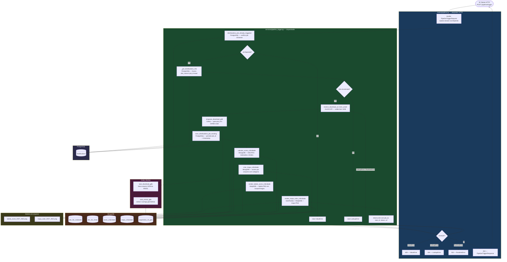

# Feature: Mapa de Calor + Score de Criticidade

Branch: `marilia/mapa-calor-score-criticidade`  
Data: 2026-04-30

---

## O que foi feito

### 1. Code Review dos arquivos modificados

Antes de qualquer merge, foi feita uma revisão completa dos arquivos em desenvolvimento. Os problemas encontrados e corrigidos foram:

| Arquivo | Problema | Correção |
|---|---|---|
| `pipeline_trigger.py` | `datetime.utcnow()` removido no Python 3.14 | `datetime.now(timezone.utc)` |
| `criticidade.py` | Função `render_mapa_criticidade` morta + `import io` órfão | Removidos |
| `criticidade.py` | `global` sem supressão do linter | `# noqa: PLW0603` |
| `routes/criticidade.py` | Magic numbers `2000`, `2030`, `2` inline | Constantes `_ANO_MIN`, `_ANO_MAX`, `_DIST_MIN_LEN` |
| `routes/criticidade.py` | `logger.info(f"...")` — f-string avaliada mesmo sem log ativo | `logger.info("...", arg1, arg2)` (lazy formatting) |
| `routes/criticidade.py` | Comentários descrevendo o óbvio | Removidos |
| `render_criticidade.py` | `geopandas`, `shapely`, `Patch` importados dentro da função | Movidos para o topo do módulo |
| `render_criticidade.py` | `_output_dir()` chamava `mkdir` a cada render | Substituído por `@lru_cache` |
| `app.py` | Import longo em linha única | Quebrado em multi-linha (isort) |
| `pipeline_trigger.py` | `from datetime import datetime` após `import httpx` | Corrigida ordem stdlib → third-party |
| `tests/test_criticidade.py` | `_AsyncIter` sem type hints | Adicionados |

---

### 2. Atualização das branches

```
upstream/dev  ──►  local dev  ──►  marilia/mapa-calor-score-criticidade
```

- `git fetch upstream` capturou novos commits do repositório original
- `git merge upstream/dev` aplicou no `dev` local (fast-forward)
- `git merge dev` aplicou na feature branch
- **6 conflitos resolvidos** nos arquivos abaixo

---

### 3. Resolução de conflitos e adaptação à refatoração do dev

O merge trouxe uma **refatoração significativa** no `dev`: o padrão de acesso ao MongoDB mudou de um singleton local (`_client`, `_db_name`) para `get_mongo_async_db()` centralizado em `database.py`.

| Arquivo | Conflito | Resolução |
|---|---|---|
| `app.py` | `lifespan` + `close_mongo_client` vs versão sem lifespan | Adotada versão do `dev` — MongoDB gerenciado pelo `database.py` |
| `services/criticidade.py` | Singleton antigo vs novo padrão `get_mongo_async_db` | Adotada versão do `dev` + função `criar_mapa_criticidade` adicionada |
| `services/pipeline_trigger.py` | Funções renomeadas no `dev` | `distribuidora_job_already_triggered` mantida do dev; `get_distribuidora_info` preservada para uso interno |
| `routes/pipeline.py` | Lógica expandida vs `trigger_pipeline_flow` do dev | Adotado `trigger_pipeline_flow` do dev como orquestrador |
| `routes/criticidade.py` | Formatação divergente | Melhorias do code review mantidas |
| `tests/test_criticidade.py` | Nomes de funções mockadas divergentes | Adotada versão do dev (`buscar_dados_realizados`, `buscar_dados_limites`) + testes de `criar_mapa_criticidade` adaptados |

`render_criticidade.py` também foi atualizado: import de `_col` substituído por `get_mongo_collection`.

---

### 4. Alinhamento com o documento de arquitetura

O arquivo `backend/docs/pipeline_trigger_service_di.md` define a regra:

> **Toda lógica de negócio deve entrar no service. O endpoint deve ser um adaptador HTTP fino.**

O fluxo estava errado — as chamadas de criticidade e render estavam na rota. Foram movidas para dentro de `trigger_pipeline_flow`:

**Antes (errado):**
```python
# routes/pipeline.py — lógica de negócio no endpoint ❌
dist_name, _ = await get_distribuidora_info(...)
result = await trigger_pipeline_flow(...)
await calcular_score_criticidade(...)
await criar_mapa_criticidade(...)
await render_tabela_score_criticidade(...)
await render_mapa_calor_criticidade(...)
return result
```

**Depois (correto):**
```python
# routes/pipeline.py — adaptador HTTP fino ✅
return await trigger_pipeline_flow(
    session=session,
    distribuidora_id=request.distribuidora_id,
    ano=request.ano,
)
```

```python
# services/pipeline_trigger.py — orquestrador ✅
async def trigger_pipeline_flow(...) -> dict:
    # 1. pré-condição
    # 2. contexto (distribuidora)
    # 3. download URL + enqueue
    # 4. tracking
    # 5. score de criticidade
    # 6. mapa de criticidade
    # 7. render tabela
    # 8. render mapa de calor
    return resultado
```

---

## Fluxo completo — ponta a ponta



---

## Estrutura de arquivos envolvidos

```
backend/
├── routes/
│   ├── criticidade.py        # GET /etl/criticidade — endpoint de consulta
│   └── pipeline.py           # POST /pipeline/trigger — adaptador HTTP fino
├── services/
│   ├── criticidade.py        # calcular_score_criticidade, criar_mapa_criticidade
│   ├── pipeline_trigger.py   # trigger_pipeline_flow — orquestrador principal
│   └── render_criticidade.py # render_tabela_score, render_mapa_calor
├── tests/
│   └── test_criticidade.py   # testes unitários do fluxo de criticidade
└── docs/
    ├── pipeline_trigger_service_di.md  # regras de arquitetura do /trigger
    └── sessao_mapa_calor_score.md      # este documento
```
